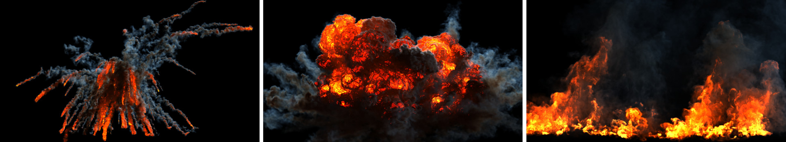
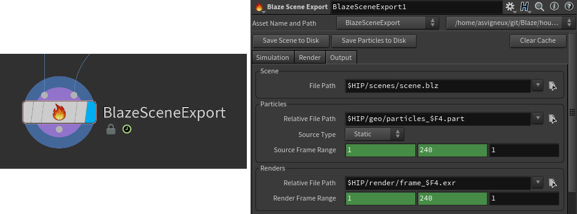

# Blaze
#### A Parallel Fluid Solver and Renderer on the GPU

<div align="center">
  
  <br>
  <a href="https://drive.google.com/file/d/1DaBsw6WKcPI_tvl-_QjJeEiXMBBwSC4V/view?usp=sharing">Technical Paper</a>
  | <a href="https://youtu.be/lxIIJf6EVqo">YouTube Video</a>
  <br><br>
</div>

**Blaze** is a fluid solver and renderer running entirely on the GPU. Our framework avoids expensive memory transfers between host and device by only
allocating grid information on the device which leads to remarkable performance
gain in practice. **Blaze** can be configured with scene descriptions generated
using a minimalist user interface for a simple and yet powerful fluid workflow.

## Main Features

* Scene Description
    * User-friendly Houdini Digital Asset to generate novel scenes
    * JSON scene descriptions (.blz)
    * Custom binary file format for efficient particle sourcing (.part)
* Simulation
    * Particle-to-grid sourcing using cubic pulse
    * Gauss-Seidel red-black parallel solve
    * Staggered grids for more accurate differentiation
    * Tricubic interpolation
    * Third order Runge-Kutta Semi-Lagrangian advection
    * Solid walls and free surface boundary conditions
    * Wind force at domain boundaries support
    * Procedural curlnoise turbulence
    * Vorticity confinement
* Rendering
    * Approximated multiple scattering of emission based on convolution
    * Shader with color ramp to remap the temperature grid as emission colors
    * Spectrally varying scattering coefficient (wavelength dependency)
    * Multiple directional lights support
    * OpenEXR, PNG and PPM output file format

## Building the Project

:boom: Blaze was developed on **Linux Fedora 31** using the **CUDA Toolkit 10.2**. It was not compiled nor tested on any other platform or hardware and might require some modifications to run in a different environment.

In order to make the build process as straightforward as possible, we let *Nsight Eclipse* take care of generating the makefiles based on our hardware and environment. *Nsight* is part of the *CUDA Toolkit* and can be downloaded here: [CUDA Toolkit Downloads](https://developer.nvidia.com/cuda-downloads).

From *Nsight* it is possible to choose **New > CUDA C/C++ Project**, name the project "Blaze" and uncheck **Use default location** to point to the location of the previously cloned Blaze repository on disk. You should be able to click **next** and then **finish** from here.

If you want the match the performance obtained in the paper you need to right-click on the project, then go to **Properties > Build > Settings > Tool Settings > Debugging** where you should uncheck all options. Next got to **Properties > Build > Settings > Tool Settings > Optimization** and check **Make use of fast math** as well as setting the **Optimization Level** to  **Optimize most (-O3)**.

From there you can simply right-click on the project and select **Build Project**. This will create a **Debug** directory containing the **Blaze** executable.

## Simulating and Rendering Scenes

:boom: **Download the .part files:** The geo directory only contains a README file with links to download the appropriate particle source files. Those are separated from the git repository because of their large size and are required to run the provided demo scenes as indicated in the next steps. See the README in the geo folder before moving to the next step.

Once you have the particle files available on disk, you can launch a Blaze simulation + render from the **Debug** directory by running the following command in a terminal:

```ShellSession
$ ./Blaze ../scenes/<sceneFile.blz>
```

If you want to log a trace of the execution you can also add the **-l** flag:

```ShellSession
$ ./Blaze -l ../scenes/<sceneFile.blz>
```

The rendered files will be written to a path relative to the **.blz** scene location on disk. This relative path is defined from the **HDA** and stored in the **.blz** scene file.

## Creating Novel Scenes

To create a new scene from scratch you will need to first install the free version of Houdini: [Houdini Apprentice Downloads](https://www.sidefx.com/products/houdini-apprentice/).

From there, you can open the provided Houdini scene in the **houdini** directory of the repository: **Blaze_demoScenes_v01.hipnc**. This should automatically pick up the provided **HDA**: **BlazeSceneExport.hdanc**. You can then navigate to any of the subnets to see how a basic Blaze scene can be created.

The scene creation and particle caching are handled by the **HDA** node at the end of each network.

<p align="center">
  
</p>

:boom: **Not production-ready:** Blaze was built as a prototype and is therefore not doing proper user input validation and exception handling.

If you have some experience using Houdini, the demo scenes should be enough to give you a good grasp of how things work. When you are done defining the new scene, you need to click on **Save Scene to Disk** to write the **.blz** file as well as **Save Particles to Disk** to write the **.part** files. At that point, you can launch your simulation and render as described in the section above.

Enjoy!

## Acknowledgments

* [Robert Bridson](https://www.cs.ubc.ca/~rbridson/) - Fluid Simulation for Computer Graphics
* [Benedikt Bitterli](https://github.com/tunabrain/incremental-fluids) - Incremental Fluids
* [Roger Allen](https://github.com/rogerallen/raytracinginoneweekendincuda) - Ray Tracing in One Weekend in CUDA
* [OpenVDB](https://github.com/AcademySoftwareFoundation/openvdb) - Open Volume DataBase
* [PVR](https://github.com/pvrbook/pvr) - Production Volume Rendering
